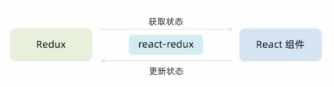
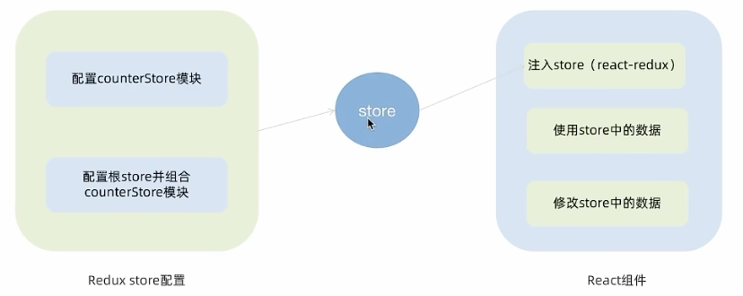

## React + Redux

### 配套工具

- 在React中使用redux，官方要求安装俩个其他插件
  - `ReduxToolkit`
  - `react-redux`

#### `Redux Toolkit(RTK)` 
官方推荐编写Redux逻辑的方式，是一套工具的集合集，简化书写方式
- 简化store的配置方式
- 内置immer支持可变式状态修改
- 内置thunk更好的异步创建

#### `react-redux`
用来链接`Redux`和`React组件`的中间件


### 搭建环境
#### 创建React项目
```bash
npx create-react-app react-redux
```
#### 安装配套工具
```bash
npm i @reduxjs/toolkit react-redux
```
#### 启动项目
```bash
npm run start
```

### 目录结构设计
```text
store
├── index.js
└── modules
    ├── channelStore.js
    └── counterStore.js
```
### 整体路径熟悉


### 使用`React Toolkit`创建counterStore
#### 子模块
```js
import { createSlice } from "@reduxjs/toolkit";

const counterStore = createSlice({
    name: "counter",
    initialState: { // 初始数据状态
        count: 0,
    },
    reducers: {     // 修改状态的方法 同步方法 支持直接修改状态
        increment: (state) => {
            state.count++
        },
        decrement: (state) => {
            state.count--
        }
    }
})

// 解构处actionCreater函数
const {increment, decrement} = counterStore.actions
// 获取reducer
const reducer = counterStore.reducer

// 以按需导出的方式导出actionCreater
export {increment, decrement}
// 以默认导出的方式导出reducer
export default counterStore
```
#### 根模块
```js
import {configureStore} from "@reduxjs/toolkit";

// 导入子模块
import counterReducer from "./modules/counterStore.js";

const store =  configureStore({
    reducer: {
        counter: counterReducer
    }
})

export default store
```

### 为React注入store
`react-redux`负责把**Redux**和**React**链接 起来，内置 `Provider` 组件 通过 store 参数把创建好的store实例注入到应用中链接正式建立
```jsx
import React from 'react';
import ReactDOM from 'react-dom/client';
import App from './App';
import store from "./store" // 导入根store
import {Provider} from 'react-redux'    // 导入Provider

// 將根組件渲染到root節點上
const root = ReactDOM.createRoot(document.getElementById('root'));
root.render(
  <React.StrictMode>
      <Provider store={store}>
          <App />
      </Provider>
   </React.StrictMode>
);
```

### React组件使用store中的数据
在React组件中使用store中的数据 需要用到一个钩子函数`useSelector` 它的作用是把store中的数据映射到组件中

```jsx
import {useSelector} from "react-redux" // 顶部导入useSelector
function MyApp() {
    const {count} = useSelector(state => state.counter)
    return (
        <div className="root">
          {count}
        </div>
    )
}
```

### React组件修改store中的数据
React组件中修改store中的数据需要借助另外一个hook函数`useDispatch`，它的作用是生成提交action对象的dispatch函数
```jsx
// 項目的根組件
import "./App.css"

import {useSelector, useDispatch} from "react-redux"
import {increment, decrement} from "./store/modules/counterStore.js";

function App() {
    const {count} = useSelector(state => state.counter)
    const dispatch = useDispatch()
    return (
        <div className="App">
            <p>count: {count}</p>
            <button onClick={() => dispatch(increment())}>increment</button>
            <button onClick={() => dispatch(decrement())}>decrement</button>
        </div>
    );
}

```