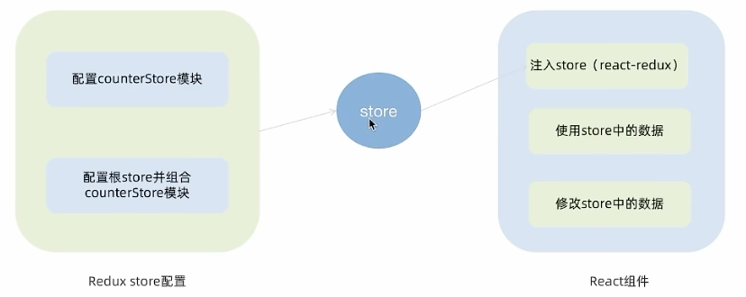

## React + Redux

### 配套工具

- 在React中使用redux，官方要求安装俩个其他插件
  - `ReduxToolkit`
  - `react-redux`

#### `Redux Toolkit(RTK)` 
官方推荐编写Redux逻辑的方式，是一套工具的集合集，简化书写方式
- 简化store的配置方式
- 内置immer支持可变式状态修改
- 内置thunk更好的异步创建

#### `react-redux`
用来链接`Redux`和`React组件`的中间件


### 搭建环境
#### 创建React项目
```bash
npx create-react-app react-redux
```
#### 安装配套工具
```bash
npm i @reduxjs/toolkit react-redux
```
#### 启动项目
```bash
npm run start
```

### 目录结构设计
```text
store
├── index.js
└── modules
    ├── channelStore.js
    └── counterStore.js
```
### 整体路径熟悉


### 使用`React Toolkit`创建counterStore
#### 子模块
```js
import { createSlice } from "@reduxjs/toolkit";

const counterStore = createSlice({
    name: "counter",
    initialState: { // 初始数据状态
        count: 0,
    },
    reducers: {     // 修改状态的方法 同步方法 支持直接修改状态
        increment: (state) => {
            state.count++
        },
        decrement: (state) => {
            state.count--
        }
    }
})

// 解构处actionCreater函数
const {increment, decrement} = counterStore.actions
// 获取reducer
const reducer = counterStore.reducer

// 以按需导出的方式导出actionCreater
export {increment, decrement}
// 以默认导出的方式导出reducer
export default counterStore
```
#### 根模块
```js
import {configureStore} from "@reduxjs/toolkit";

// 导入子模块
import counterReducer from "./modules/counterStore.js";

const store =  configureStore({
    reducer: {
        counter: counterReducer
    }
})

export default store
```

### 为React注入store
`react-redux`负责把**Redux**和**React**链接 起来，内置 `Provider` 组件 通过 store 参数把创建好的store实例注入到应用中链接正式建立

```jsx
import React from 'react';
import ReactDOM from 'react-dom/client';
import App from './App';
import store from "./store" // 导入根store
import {Provider} from 'react-redux'    // 导入Provider

// 將根組件渲染到root節點上
const root = ReactDOM.createRoot(document.getElementById('root'));
root.render(
  <React.StrictMode>
      <Provider store={store}>
          <App />
      </Provider>
   </React.StrictMode>
);
```

### React组件使用store中的数据
在React组件中使用store中的数据 需要用到一个钩子函数`useSelector` 它的作用是把store中的数据映射到组件中

```jsx
import {useSelector} from "react-redux" // 顶部导入useSelector
function MyApp() {
    const {count} = useSelector(state => state.counter)
    return (
        <div className="root">
          {count}
        </div>
    )
}
```

### React组件修改store中的数据
React组件中修改store中的数据需要借助另外一个hook函数`useDispatch`，它的作用是生成提交action对象的dispatch函数
```jsx
// 項目的根組件
import "./App.css"

import {useSelector, useDispatch} from "react-redux"
import {increment, decrement} from "./store/modules/counterStore.js";

function App() {
    const {count} = useSelector(state => state.counter)
    const dispatch = useDispatch()
    return (
        <div className="App">
            <p>count: {count}</p>
            <button onClick={() => dispatch(increment())}>increment</button>
            <button onClick={() => dispatch(decrement())}>decrement</button>
        </div>
    );
}

```

### 提交action传参实现需求
在reducers的同步修改方法中添加action对象参数，在调用`actionCreater`的时候传递参数，参数会被传递到action对象`payload`属性上
```jsx
reducers: {     // 修改状态的方法 同步方法 支持直接修改状态
        increment: (state) => {
            state.count++
        },
        decrement: (state) => {
            state.count--
        },
        add2Nums: (state, action) => {
            state.count = action.payload    // 这里的payload就是传递的参数
        }
    }
```

### Redux异步参数
1. 创建store的写法保持不变，配置好同步修改状态的方法
```js
const channelStore = createSlice({
  name: 'channel',
  initialState: {
    channelList: [],
  },
  reducers: {
    setChannels(state, action) {    // 同步修改
      state.channelList = action.payload
    }
  }
})

```
2. 单独封装一个函数，在函数内部return一个新的数，在新函数中
   1. 封装异步请求获取数据 
    ```js
    // 异步请求部分
    const fetchChannels = () => {
      return async (dispatch) => {
        const res =  await axios.get('http://geek.itheima.net/v1_0/channels')
        dispatch(setChannels(res.data.data.channels))
      }
    }
    ```
   2. 调用同步actionCreater传入异步数据生成一个action对象，并使用dispatch提交
    ```jsx
    useEffect(() => {
      dispatch(fetchChannels())
    }, [dispatch]);
    ```
3. 组件中dispatch的写法保持不变

## ReactRouter
### 环境配置
```bash
npm i react-router-dom
```

### 快速开始
```jsx
import {createBrowserRouter, RouterProvider} from "react-router-dom";

const router = createBrowserRouter([    // 路由和对应关系
    {
        path: '/login',
        element: <div>Login</div>
    },
    {
        path: '/article',
        element: <div>Article</div>
    },
])

const root = ReactDOM.createRoot(document.getElementById('root'));
root.render(
    <Provider store={store}>
        {/*<App />*/}
        <RouterProvider router={router}></RouterProvider>
    </Provider>
);
```

### 编程式路由导航
编程式导航是指通过`useNavigate`钩子得到导航方法，然后通过调用方法以命令式的形式进行路由跳转，登录请求完毕之后跳转就可以选择这种方式，更加灵活
比如想在登录完毕后进行跳转
```jsx
import {Link, useNavigate} from "react-router-dom";
function Login() {
    const navigate = useNavigate();
    useEffect(() => {
        console.log('aaa')
    }, []);
    return (
        <div className="root">
            <div className="login-card">
                Login
                {/*声明式方法*/}
                <Link to={'/article'}>跳转到到Article</Link>
                {/*命令式的方法*/}
                <button onClick={() => {navigate('/article')}}>跳转到Article</button>
            </div>
        </div>
    )
}
```

#### 路由传参

1. searchParams传参
```jsx
// 发送
<button onClick={() => {
navigate('/article?id=101&name=kanna')
}}>
    searchParams传参
</button>
```
```jsx
// 接收
import {useSearchParams} from "react-router-dom";
const Article = () => {
    const [params] = useSearchParams();
    let id = params.get('id')
    let name = params.get('name')
    return (
        <div className="root">
            <div className="login-card">
                <p>article</p><p>{id}</p><p>{name}</p>
            </div>
        </div>
    )
}
```

2. params传参
```jsx
// 发送
<button onClick={() => {
    navigate('/article/101/kanna')
}}>
    params传参
</button>
```
```jsx
// 路由
const router = createBrowserRouter([
    {
        path: '/login',
        element: <Login />
    },
    {
        // 这里需要设置占位符
        path: '/article/:id/:name',
        element: <Article />
    },
])
```
```jsx
// 接收
import {useParams} from "react-router-dom";
const Article = () => {
    const params = useParams()
    let id = params.id
    let name = params.name
    return (
        <div className="root">
            <div className="login-card">
                <p>article</p><p>{id}</p><p>{name}</p>
            </div>
        </div>
    )
}
```

#### 嵌套路由配置
1. 使用`children`属性配置路由嵌套关系
```jsx
const router = createBrowserRouter([
    {
        path: '/',
        element: <Layout/>,
        children: [
            {
                path: '/about',
                element: <About/>
            },
            {
                path: '/board',
                element: <Board/>
            },
        ]
    },
])
```
2. 使用`<Outlet/>`组件配置二级路由渲染位置
```jsx
import {Outlet, Link} from "react-router-dom";
const Layout = () => {
    return (
        <div>
            <Link to={'/board'}>转到Board</Link>
            <Link to={'/about'}>转到About</Link>
            <p>一级路由组件</p>
            <Outlet />
        </div>
    )
}
export default Layout
```

#### 默认二级路由
当访问的是一级路由时 默认的二级路由组件可以得到渲染 只需要在二级路由的位置去掉`path` 设置`index`属性为`true`
```jsx
const router = createBrowserRouter([
    {
        path: '/',
        element: <Layout/>,
        children: [
            {
                path: '/about',
                element: <About/>
            },
            {
                // path: '/board',
                index: true,    // 设置默认的二级路由
                element: <Board/>
            },
        ]
    },
])
```
```jsx
import {Outlet, Link} from "react-router-dom";
const Layout = () => {
    return (
        <div>
            {/*设置为/*/}
            <Link to={'/'}>转到Board</Link>
            <Link to={'/about'}>转到About</Link>
            <p>一级路由组件</p>
            <Outlet />
        </div>
    )
}
export default Layout
```

#### 404路由配置
当浏览器输入url的路径在整个路由配置中都找不到对应的 path 为了用户体验 可以使用 404 兜底组件进行渲染
- 实现步骤:
1. 准备一个NotFound组件
```jsx
function NotFound() {
    // ...
}
```
2. 在路由表数组的末尾，以`*`号作为路由path配置路由
```jsx
const router = createBrowserRouter([
    {
        path: '/',
        element: <Layout/>,
        children: [
            { /* ... */},
            { /* ... */},
        ]
    },
    {
        path: '*',
        element: <NotFound />
    }
])
```

### React.memo的props比较机制

- **机制：** 在使用`props`缓存组件之后 React会对每一个prop只用`Object.is`比较老值和新值 返回true表示没有变化

1. prop 是简单类型

```jsx
Object.is(3, 3) => true
```

1. prop是引用类型( `{}` / `[]` ) 因为父组件在重新渲染的时候 实际上形成的是一个新的数组引用

```jsx
Object.is([], []) = > false
```

- 那么怎么保持引用稳定 使用`useMemo`

```jsx
const myLists2 = useMemo(() => {
        return [1, 2, 3]
    }, [])
```

### `useCallback`

- **作用：** 在组件多次重新渲染的时候缓存函数

```jsx
import {memo, useCallback, useState} from "react"

const MyInput = memo(function MyInput (props) {
    console.log('子组件渲染了')
    return <input type="text" onChange={(e) => props.onChange(e.target.value)} />
})

const App = () => {
    const [count, setCount] = useState(0)
    const handleChange = useCallback((value) => console.log(value), [])
    return (
        <div>
            <MyInput onChange={handleChange} />
            <button onClick={() => setCount(count + 1)}>{count}</button>
        </div>
    )
}

export default App
```

### `forwardRef`

